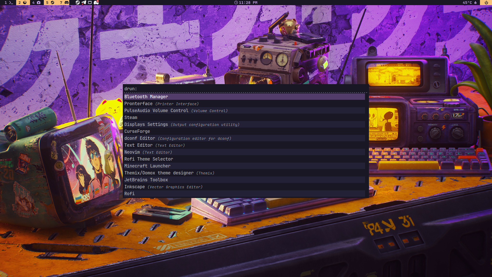
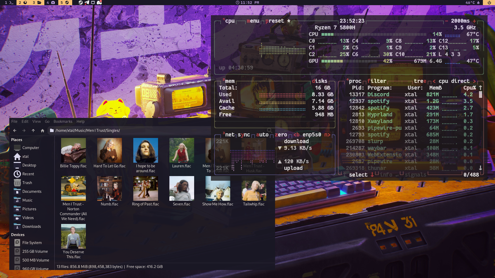
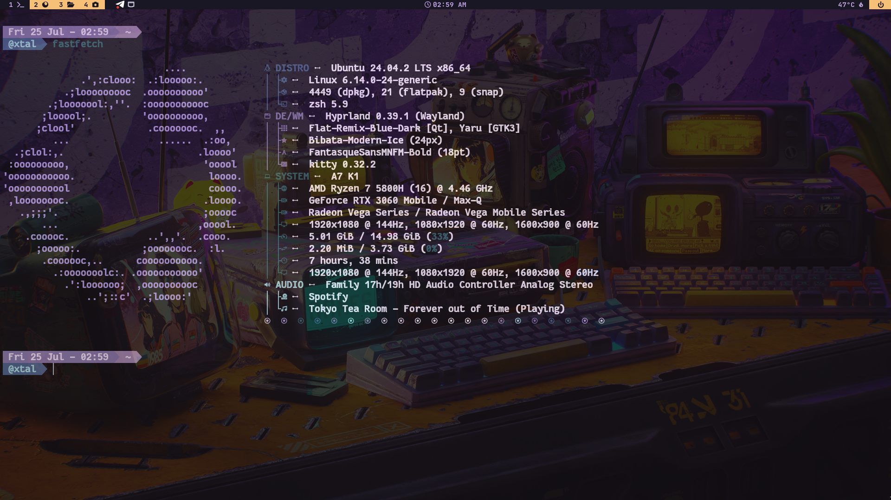
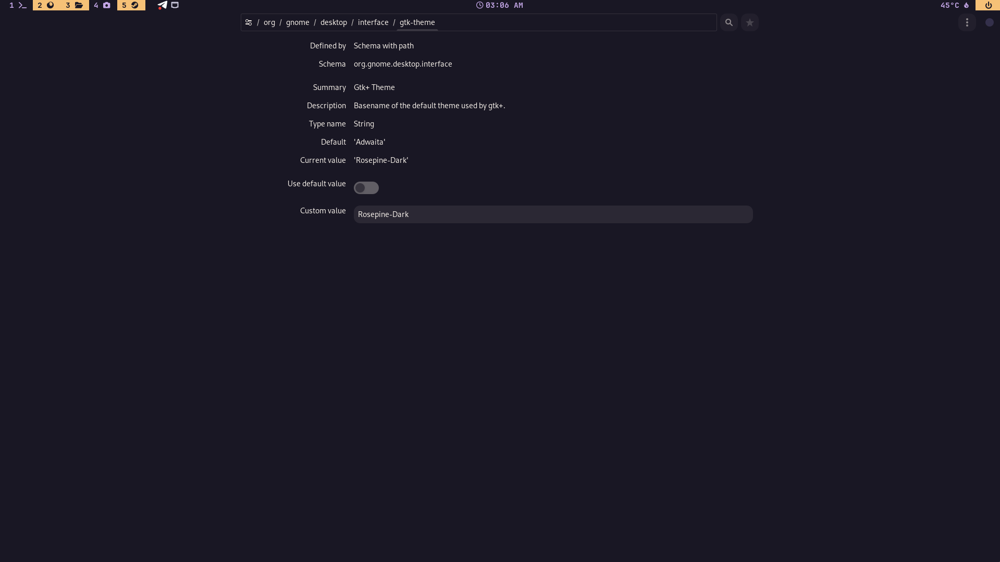

# Hyprland Dotfiles

This repository contains my personal dotfiles for a Linux system running [Hyprland](https://github.com/hyprwm/Hyprland), a dynamic tiling Wayland compositor. The wallpaper was created by [jrmnt](https://wallhaven.cc/user/jrmnt) in the [Wallhaven](https://wallhaven.cc/) platform.






## Features

- Hyprland configuration
- Wayland environment setup
- Theming (GTK, icons, cursors)
- Terminal and shell configs (e.g., zsh, bash)
- Editor configs (e.g., Neovim)
- Scripts and utilities

## Structure

- `hypr/` — Hyprland configs
- `waybar/` — Waybar status bar configs
- `scripts/` — Custom scripts
- `nvim/` — Neovim configs
- `gtk/` — GTK themes and settings
- `icons/` - Icon themes
- `kitty/` — Kitty terminal configs
- `gtk-theme` — GTK themes

### Setup

I currently don't have an install script, but you can manually copy the files to your home directory or use a symlink approach.

```sh
git clone https://github.com/Xtalism/linux-ricing-dotfiles.git
cd dotfiles/
```

## Installation

**Warning:** These dotfiles are tailored for my workflow and may overwrite your existing configs.

### Prerequisites

- Linux (tested on Arch, Fedora, Ubuntu)
- Hyprland
- Wayland
- Rofi
- GTK
- Waybar
- Git

#### GTK Themes

In order to use the GTK themes, you need to install `dconf-editor`:

```sh
sudo apt install dconf-editor
```

Once installed, go to your `~/.themes`, copy the GTK themes from this repository to your `~/.themes` directory.

```sh
mkdir -p ~/.themes
cd ~/.themes
mv ~linux-ricing-dotfiles/gtk-theme/Rosepine-Dark .
```

Now in your terminal run `dconf-editor`, navigate to `org/gnome/desktop/interface`, and set the `gtk-theme` to `Rosepine-Dark`.



#### Icons

It is recommended to created a directory for icons in your home directory, such as `~/.icons`, and then copy the icon theme from this repository to that directory.

```sh
mkdir -p ~/.icons
cd ~/.icons
mv ~/linux-ricing-dotfiles/icons/RoséPine-Moon .
```

Once copied, you can set the icon theme using `gsettings`:

```sh
gsettings set org.gnome.desktop.interface icon-theme "RoséPine-Moon"
```
